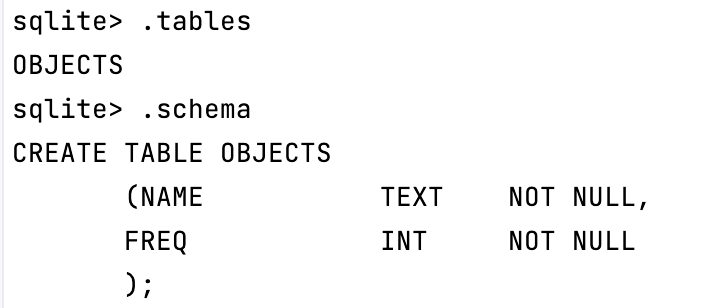

<<<<<<< Updated upstream
# ProgMate
=======
# ProgMate
## 2.1 语料实体库构建
### 1.数据格式处理
    DataFormat目录下.
### 规则匹配：
    核心代码在Match目录下.
#### 环境配置：
##### 1.Pycharm中创建`Conda Environment`;
    参考：https://blog.csdn.net/D1179869625/article/details/122302369
##### 2.安装`PyTorch`框架;
##### 3.安装`ltp`.
    参考：https://github.com/HIT-SCIR/ltp
    说明：当前代码包中，已下载`Base`模型和`Legacy`模型，分别对应`base`和`legacy`文件夹，可直接调用。
    从少量测试结果看，词性标注准确性`Base`模型偏高，后续可在`base`中`vocab.txt`加入关键词，提高标注效果；
##### 4.安装`sqlite3`;
    说明：当前构建语料数据库`Objects.db`(测试性),数据来源为`/DataFormat/text`中文件，表名为`OBJECTS`，存储的键值对为`目标实体-词频`.

#### 程序入口：buildDB.py.
    在buildDB.py中，可直接创建数据库表，指定数据来源后，运行即可完成语料库的构建。
#### 注记：
    Github单个文件大小限制为100MB,过大文件存储可用git-lfs,参见：
    https://docs.github.com/en/repositories/working-with-files/managing-large-files
>>>>>>> Stashed changes
